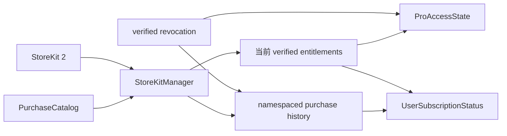

# PurchaseKit 公开库唯一上游设计

## 背景

本仓库将成为 PurchaseKit 的唯一上游。当前的
`AppSupportKit` 是一个仅包含 `UserDefaultsProtocol` 的相邻本地包，PurchaseKit
通过 `../AppSupportKit` 路径依赖它；Dit 与 MarkIt 又各自维护了发生漂移的
PurchaseKit 副本。当前形态无法作为可复现、可版本化的公开 Swift Package。

本设计把现有实现收敛为一个可独立安装的仓库，吸收分叉中已经证明有价值的
通用修复，同时拒绝应用专属文案、危险授权回退和仅记录问题却不验证行为的测试。

## 目标

- 保留 `PurchaseKit` 仓库名、Package 名、product 名和 Swift 模块名。
- 让本仓库成为唯一 source of truth。
- 通过一个 Git URL 即可解析、构建和测试完整包。
- 修复价格计算、促销签名、缓存一致性和订阅历史识别问题。
- 提供稳定、可配置、UI 无关的公开 API。
- 建立公开仓库所需的许可证、入口文档、测试说明、交付说明和 CI。

## 非目标

- 不支持 iOS 17 以下系统。
- 不实现服务端收据验证、促销签名服务或 App Store Server API。
- 不提供 paywall UI、应用营销文案或 analytics SDK。
- 不在核心库中保存 App Store 私钥、shared secret 或其他凭据。
- 不把 Dit、MarkIt 的整个目录机械覆盖到唯一上游。

## 已确认的公开契约

- 名称：`PurchaseKit`
- 许可证：MIT
- Swift tools version：5.9
- 首发平台：iOS 17+
- 安装方式：Swift Package Manager Git URL
- 版本策略：首个持久公开标签为 `0.1.1`，后续遵循 Semantic Versioning
- 提交信息：使用中文

## 仓库与模块结构

最终包结构为：

```text
PurchaseKit/
├── .github/workflows/ci.yml
├── Sources/
│   └── PurchaseKit/
│       └── UserDefaultsProtocol.swift
├── Tests/
│   └── PurchaseKitTests/
├── docs/
│   ├── feature-docs/
│   └── superpowers/
├── Package.swift
├── README.md
├── LICENSE
├── AGENTS.md
├── ARCH.md
├── TESTING.md
└── DELIVERY.md
```

`UserDefaultsProtocol` 直接并入 `PurchaseKit` target，因为它出现在
`PurchaseCache` 的公共注入接口中；不为单个协议增加隐藏 target。外部调用者只需导入
`PurchaseKit`。原来的
原相邻目录中的 `AppSupportKit` 在消费者完成迁移后删除，不再独立版本化。

## 分叉吸收策略

### Dit 分叉：吸收

- 价格除零、非有限数和负节省保护。
- `NumberFormatter` 失败时不硬编码人民币符号。
- 月均价格使用 StoreKit 的 `Decimal` 与 `priceFormatStyle`，避免转成 `Double`。
- 多订阅交易中仅把有效、未过期交易记录为 `activeTransaction`。
- 兼容历史上以 `Date` 或数值写入的缓存时间。
- 清除离线缓存时同步清除内存中的权益状态。
- 没有 `PromotionalOfferSigning` 时不展示或应用促销优惠。
- 记录非过期权益证据与本地购买历史，但重新设计其退款验证策略。

### Dit 分叉：拒绝或重写

- 不吸收“已撤销订阅仍可通过离线缓存授权”的回退；`.revoked` 永远拒绝访问。
- 不吸收把所有错误退化为 `"Store error"` 的实现。
- 不吸收重新硬编码中文价格和营销文案的改动。
- 不直接复制包含恒真断言、镜像生产算法或只写注释的 adversarial probes；把真实问题
  重写成能够先失败、再验证修复的行为测试。
- 不让终身购买永久跳过退款验证；仅避免不必要的交互式同步，同时保留非交互式权益刷新。

### MarkIt 分叉

MarkIt 主要保留较旧的状态与价格实现，并包含“智能调度”等应用专属文案。这些内容
不进入公开库。其 introductory-offer 缓存思路仅作为测试场景参考，不替换 StoreKit 的
实时 eligibility 判断。

## 公共 API 设计

### Catalog

`PurchaseCatalog` 继续负责宿主应用的商品 ID 映射。`StoreKitManager` 的公开初始化器
必须显式接收 `PurchaseCatalog`，不再默认使用 `.stub`。`.stub` 只保留在测试或 preview
辅助代码中，不能成为生产默认值。

### Configuration

`StoreKitConfiguration` 提供公共初始化器。初始化器接收一个非空 `namespace` 和所有
时间策略，缓存键由 namespace 派生。`.default` 使用宿主 bundle identifier 加
`.PurchaseKit` 作为 namespace；无 bundle identifier 时使用 `PurchaseKit`。

`PurchaseCache` 在目标 key 尚不存在时执行一次旧 key 到 namespaced key 的迁移，避免
已经上线的应用因采用公开库而丢失本地购买记录。迁移只复制已知旧 key，不覆盖新值。

### 权益状态

库区分两个事实：

1. 当前已验证权益：来自 `Transaction.currentEntitlements`，决定当前在线授权。
2. 历史购买身份：来自经过验证后写入的本地历史，用于区分新用户与过期/取消用户。

当前权益为空时不能直接清除历史购买身份。状态计算先处理 verified revocation，再处理
当前订阅状态，最后才使用历史身份分类 `.expiredSubscriber` 或 `.cancelledSubscriber`。
离线宽限只适用于上次已验证且未出现撤销证据的权益；`.revoked` 不可被离线缓存覆盖。

### 促销优惠

促销优惠需要服务端 JWS 签名。未配置 signer 时：

- eligibility 不返回 promotional offer；
- 显式请求 promotional offer 时抛出 `.offerNotAvailable`；
- 不允许静默退回原价购买。

### 文案与错误

核心库返回结构化状态、StoreKit 提供的 `displayPrice` 以及稳定错误 case。应用展示文案、
营销标题和本地化由宿主负责。现有硬编码文案 API 在迁移消费者后删除；不在 0.1.1
公开合同中保留应用专属字符串。

空 analytics 方法和仅重新计算状态的 campaign stub 从公共 API 删除。需要埋点的宿主
在购买结果或状态变化处自行记录。

## 数据流



购买成功、恢复和 transaction update 都经过同一条 verified transaction 处理路径；该
路径更新当前权益、历史身份、缓存时间和观察状态。失败只在网络或暂时性 StoreKit 错误
时使用离线宽限，验证失败与撤销不会授予权益。

## 测试设计

### 稳定单元测试

- 价格：零值、NaN/Inf、负节省、非人民币 locale、Decimal 月均价格。
- 缓存：namespace、旧 key 迁移、Date/Double 时间兼容、清除后状态一致。
- 状态：新用户、有效订阅、过期、取消、终身、宽限、billing retry、revoked。
- 促销：无 signer 时不展示、不静默原价购买；有 signer 时传递正确 option。
- 生命周期：listener 与 refund task 在 manager 释放时取消。

这些测试使用可控的 service/cache double，不依赖 StoreKit 配置文件。

### StoreKit 集成测试

`PurchaseKitTest.storekit` 作为测试 target 的单文件资源放到 bundle 根部，测试会话创建失败
必须直接抛出并使 setUp 失败，不能只打印后继续。集成测试覆盖产品加载、购买、恢复、
intro eligibility 与 transaction finish。

### CI

GitHub Actions 在当前 Xcode 稳定版的 iOS 17+ 模拟器上运行：

1. `swift package dump-package`
2. iOS Simulator build
3. 稳定单元测试
4. StoreKit 集成测试
5. `git diff --check`

## 文档治理

- `README.md`：项目入口、能力边界、安装与最小示例。
- `ARCH.md`：target 边界、依赖方向、权益状态与缓存规则的唯一来源。
- `TESTING.md`：测试分层、命令和变更到验证方式的映射。
- `DELIVERY.md`：CI、版本、打标签和回滚流程。
- `AGENTS.md`：最小 agent 约束，指向以上规则源，不复制正文。
- `docs/feature-docs/`：需要长期维护的 StoreKit 行为说明。
- `docs/superpowers/`：本次设计与实施计划；完成后作为决策记录保留。

不创建空的 `RULES.md`、产品规格目录或 issue 目录；当前小型库没有独立长期职责需要它们。

## 消费者迁移

迁移按应用逐一完成：

1. 让应用指向唯一上游的本地 package 或公开 Git URL。
2. 迁移应用专属文案到宿主项目。
3. 运行该应用的购买、恢复与 paywall 测试。
4. 删除应用仓库内的 `Packages/PurchaseKit` 副本或绝对路径 symlink。

先迁移 Dit，因为它包含最多的分叉修复和测试证据；随后迁移 MarkIt；其他引用方在各自
验证通过后移除本地副本。没有通过宿主测试的应用不删除旧副本。

## 完成标准

- 仓库可以从独立 checkout 解析，不依赖 `../AppSupportKit`。
- 所有新增行为都完成可观察的 TDD red-green 循环。
- iOS 17+ build、稳定单测和 StoreKit 集成测试全部通过且正常退出。
- README、MIT LICENSE、ARCH、TESTING、DELIVERY、AGENTS 和 CI 均存在且互相链接正确。
- secret 与绝对路径扫描无命中。
- Dit 与 MarkIt 的通用修复已逐项裁决，应用专属内容未进入公共库。
- 至少一个实际消费者完成唯一上游迁移验证后，才创建 `0.1.1` 标签。
